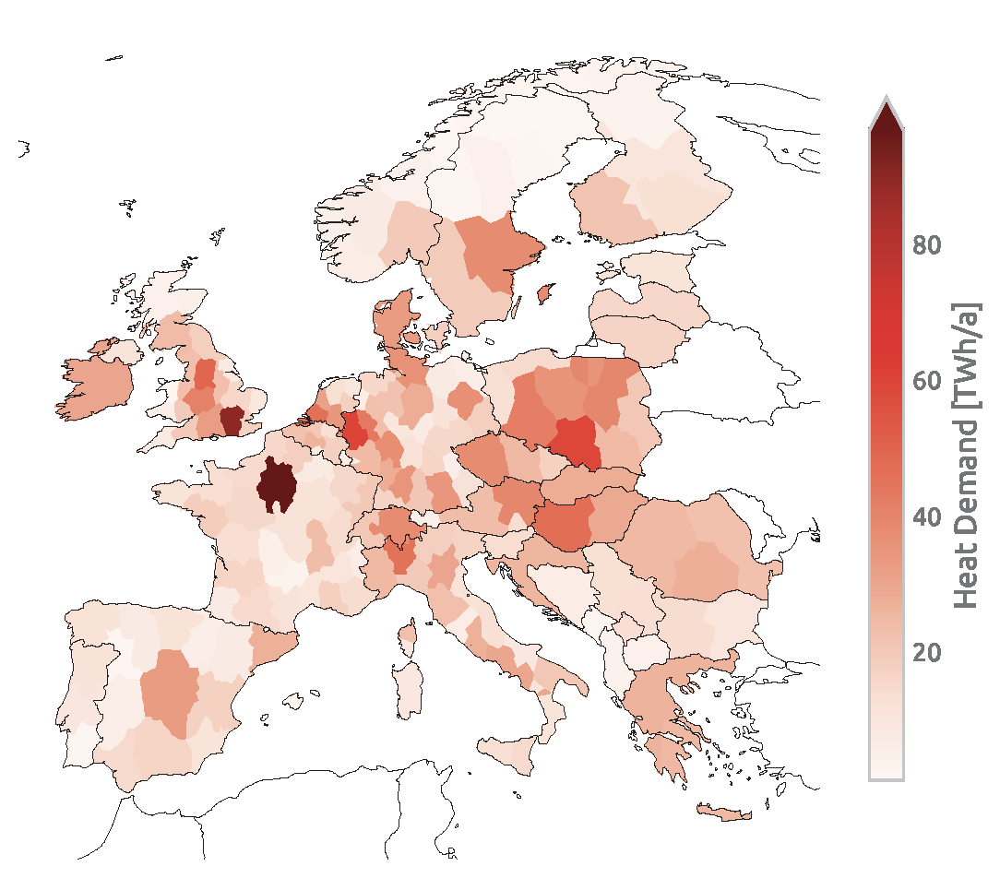
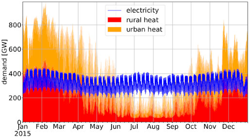

.. _supply_demand:

##########################################
Supply and demand
##########################################

An initial orientation to the supply and demand options in the model
PyPSA-Eur-Sec can be found in the description of the model
PyPSA-Eur-Sec-30 in the paper `Synergies of sector coupling and
transmission reinforcement in a cost-optimised, highly renewable
European energy system <https://arxiv.org/abs/1801.05290>`_ (2018).
The latest version of PyPSA-Eur-Sec differs by including biomass,
industry, industrial feedstocks, aviation, shipping, better carbon
management, carbon capture and usage/sequestration, and gas networks.

The basic supply (left column) and demand (right column) options in the model are described in this figure:

.. image:: ../graphics/multisector_figure.png

Electricity supply and demand
=============================

Electricity supply and demand follows the electricity generation and
transmission model `PyPSA-Eur <https://github.com/PyPSA/pypsa-eur>`_,
except that hydrogen storage is integrated into the hydrogen supply,
demand and network, and PyPSA-Eur-Sec includes CHPs.

Unlike PyPSA-Eur, PyPSA-Eur-Sec does not distribution electricity demand for industry according to population and GDP, but uses the
geographical data from the `Hotmaps Industrial Database
<https://gitlab.com/hotmaps/industrial_sites/industrial_sites_Industrial_Database>`_.

Also unlike PyPSA-Eur, PyPSA-Eur-Sec subtracts existing electrified heating from the existing electricity demand, so that power-to-heat can be optimised separately.

The remaining electricity demand for households and services is distributed inside each country proportional to GDP and population.

Heat demand
=============================
Building heating in residential and services sectors is resolved regionally, both for individual buildings and district heating systems, which include different supply options [To do:link to next section]
Annual heat demands per country are retrieved from `JRC-IDEES  <https://op.europa.eu/en/publication-detail/-/publication/989282db-ad65-11e7-837e-01aa75ed71a1/language-en>`_ and split into space and water heating. For space heating, the annual demands are converted to daily values based on the population-weighted Heating Degree Day (HDD) using the `atlite tool <https://github.com/PyPSA/atlite>`_, where space heat demand is proportional to the difference between the daily average ambient temperature (read from `ERA5 <https://doi.org/10.1002/qj.3803>`_) and a threshold temperature above which space heat demand is zero. A threshold temperature of 15 °C is assumed by default. The daily space heat demand is distributed to the hours of the day following heat demand profiles from `BDEW <https://github.com/oemof/demandlib>`_. These differ for weekdays and weekends/holidays and between residential and services demand.  

•	Space heating
The space heating demand can be exogenously reduced by retrofitting measures that improve the buildings’ thermal envelopes [Refer to PyPSA-Eur-Sec Config file, `line 212 <https://github.com/PyPSA/pypsa-eur-sec/blob/3daff49c9999ba7ca7534df4e587e1d516044fc3/config.default.yaml#L212>`_.

.. literalinclude:: ../config.default.yaml
    :language: yaml
    :lines: 212

Co-optimsing of building renovation is also possible, if it is activated in the `config file <https://github.com/PyPSA/pypsa-eur-sec/blob/3daff49c9999ba7ca7534df4e587e1d516044fc3/config.default.yaml#L222>`_.
Renovation of the thermal envelope reduces the space heating demand and is optimised at each node for every heat bus. Renovation measures through additional insulation material and replacement of energy inefficient windows are considered.
In a first step, costs per energy savings are estimated in `build_retro_cost.py <https://github.com/PyPSA/pypsa-eur-sec/blob/master/scripts/build_retro_cost.py>`_. They depend on the insulation condition of the building stock and costs for renovation of the building elements. In a second step, for those cost per energy savings two possible renovation strengths are determined: a moderate renovation with lower costs, a lower maximum possible space heat savings, and an ambitious renovation with associated higher costs and higher efficiency gains. They are added by step-wise linearisation in form of two additional generations in `prepare_sector_network.py <https://github.com/PyPSA/pypsa-eur-sec/blob/master/scripts/prepare_sector_network.py>`_.
Further information are given in the publication :
 `Mitigating heat demand peaks in buildings in a highly renewable European energy system, (2021)  <https://arxiv.org/abs/2012.01831>`_.
•	Water heating
Hot water demand is assumed to be constant throughout the year.
•	Urban and rural heating
For every country, heat demand is split between low and high population density areas. These country-level totals are then distributed to each region in proportion to their rural and urban populations respectively. Urban areas with dense heat demand can be supplied with large-scale district heating systems. The percent of urban heat demand that can be supplied by district heating networks as well as lump-sum losses in district heating systems is exogenously determined in the `Config file <https://github.com/PyPSA/pypsa-eur-sec/blob/3daff49c9999ba7ca7534df4e587e1d516044fc3/config.default.yaml#L153>`_. 

•	Cooling demand
Cooling is electrified and is included in the electricity demand. Cooling demand is assumed to remain at current levels.  An example of regional distribution of the total heat demand for network 181 regions is depicted below.

As below figure shows, the current total heat demand in Europe is similar to the total electricity demand but features much more pronounced seasonal variations. The current total building heating demand in Europe adds up to 3084 TWh/a of which 78% occurs in urban areas.

In practice, in PyPSA-Eur-Sec, there are heat demand buses to which the corresponding heat demands are added. 

1)	Urban central heat: large-scale district heating networks in urban areas with dense heat population. Residential and services demand in these areas are added as demands to this bus
2)	Residential urban decentral heat: heating for residential buildings in urban areas not using district heating
3)	Services urban decentral heat: heating for services buildings in urban areas not using district heating
4)	Residential rural heat: heating for residential buildings in rural areas with low population density.
5)	Services rural heat: heating for residential services buildings in rural areas with low population density. Heat demand from agriculture  sector is also included here. 

Heat supply
=======================

Different supply options are available depending on whether demand is met centrally through district heating systems, or decentrally through appliances in individual buildings. 

**Urban central heat:** 

For large-scale district heating systems the following options are available: combined heat and power (CHP) plants consuming gas or biomass from waste and residues with and without carbon capture (CC), large- scale air-sourced heat pumps, gas and oil boilers, resistive heaters, and fuel cell CHPs. Additionally, waste heat from the `Fischer-Tropsch <https://github.com/PyPSA/pypsa-eur-sec/blob/3daff49c9999ba7ca7534df4e587e1d516044fc3/config.default.yaml#L255>`_  and `Sabatier <<https://github.com/PyPSA/pypsa-eur-sec/blob/3daff49c9999ba7ca7534df4e587e1d516044fc3/config.default.yaml#L240>`_ processes for the production of synthetic hydrocarbons can supply district heating systems. 

**Residential and Urban decentral heat:**

Supply options in individual buildings include gas and oil boilers, air- and ground-sourced heat pumps, resistive heaters, and solar thermal collectors.
Ground-source heat pumps are only allowed in rural areas because of space constraints. Thus, only air- source heat pumps are allowed in urban areas. This is a conservative assumption, since there are many possible sources of low-temperature heat that could be tapped in cities (e.g. waste water, ground water, or natural bodies of water). Costs, lifetimes and efficiencies for these technologies are retrieved from the `Technology-data repository <https://github.com/PyPSA/technology-data>`_.

Below are more detailed explanations for each heating supply component, all of which are modeled as `Links <https://pypsa.readthedocs.io/en/latest/components.html?highlight=distribution#link>`_. in PyPSA-Eue-Sec.

•	Large Combined Heat and Power plants are included in the model if it is specified in the `config file. <https://github.com/PyPSA/pypsa-eur-sec/blob/3daff49c9999ba7ca7534df4e587e1d516044fc3/config.default.yaml#L235>`_.
 
CHPs are based on back pressure plants operating with a fixed ratio of electricity to heat output. The efficiencies of each are given on the back pressure line, where the back pressure coefficient cb is the electricity output divided by the heat output. (For a more complete explanation of the operation of CHPs refer to the study by Dahl et al. : `Cost sensitivity of optimal sector-coupled district heating production systems <https://arxiv.org/pdf/1804.07557.pdf>`_.

PyPSA-Eur-Sec includes CHP plants fueled by methane and solid biomass from waste and residues. Hydrogen fuel cells also produce both electricity and heat.

The methane CHP is modeled on the Danish Energy Agency (DEA) “Gas turbine simple cycle (large)” while the solid biomass CHP is based on the DEA’s “09b Wood Pellets Medium”. For biomass CHP, cb = `0.46 <https://ens.dk/sites/ens.dk/files/Statistik/technology_data_catalogue_for_el_and_dh_-_0009.pdf#page=156>`_ , whereas for gas CHP, cb = `1 <https://ens.dk/sites/ens.dk/files/Statistik/technology_data_catalogue_for_el_and_dh_-_0009.pdf#page=64>`_.

NB: The old PyPSA-Eur-Sec-30 model assumed an extraction plant (like the DEA coal CHP) for gas which has flexible production of heat and electricity within the feasibility diagram of Figure 4 in the study by `Brown et al. <https://arxiv.org/abs/1801.05290>`_ We have switched to the DEA back pressure plants since these are more common for smaller plants for biomass, and because the extraction plants were on the back pressure line for 99.5% of the time anyway. The plants were all changed to back pressure in PyPSA-Eur-Sec v0.4.0.

-  Micro-CHP 
Pypsa-eur-sec allows individual buildings to make use of `micro gas CHPs <https://github.com/PyPSA/pypsa-eur-sec/blob/3daff49c9999ba7ca7534df4e587e1d516044fc3/config.default.yaml#L236>`_ that are assumed to be installed at the distribution grid level.

•	Heat pumps
The coefficient of performance (COP) of air- and ground-sourced heat pumps depends on the ambient or soil temperature respectively. Hence, the COP is a time-varying parameter[refer to `Config <https://github.com/PyPSA/pypsa-eur-sec/blob/3daff49c9999ba7ca7534df4e587e1d516044fc3/config.default.yaml#L206>`_ file). Generally, the COP will be lower during winter when temperatures are low. Because the ambient temperature is more volatile than the soil temperature, the COP of ground-sourced heat pumps is less variable. Moreover, the COP depends on the difference between the source and sink temperatures:

$$ &Delta; T = T_(sink) − T_(source) $$ 

For the sink water temperature Tsink we assume 55 °C [`Config <https://github.com/PyPSA/pypsa-eur-sec/blob/3daff49c9999ba7ca7534df4e587e1d516044fc3/config.default.yaml#L207>`_ file] For the time- and location-dependent source temperatures Tsource, we rely on the `ERA5 <https://doi.org/10.1002/qj.3803>`_ reanalysis weather data. The temperature differences are converted into COP time series using results from a regression analysis performed in the study by `Stafell et al. <https://pubs.rsc.org/en/content/articlelanding/2012/EE/c2ee22653g>`_. For air-sourced heat pumps (ASHP), we use the function:

$$ COP (&Delta; T) = 6.81 + 0.121&Delta; T + 0.000630.&Delta; T^2; $$   

for ground-sourced heat pumps (GSHP), we use the function:

$$  COP(&Delta; T) = 8.77 + 0.150&Delta; T + 0.000734&Delta; T^2 $$     

•	Resistive heaters (can be activated in Config from the `boilers <https://github.com/PyPSA/pypsa-eur-sec/blob/3daff49c9999ba7ca7534df4e587e1d516044fc3/config.default.yaml#L232>`_ option)
Resistive heaters produce heat with a fixed conversion efficiency (refer to `Technology-data repository <https://github.com/PyPSA/technology-data>`_ ). 

•	Gas, oil, and biomass boilers (can be activated in Config from the `boilers <https://github.com/PyPSA/pypsa-eur-sec/blob/3daff49c9999ba7ca7534df4e587e1d516044fc3/config.default.yaml#L232>`_ , `oil boilers <https://github.com/PyPSA/pypsa-eur-sec/blob/3daff49c9999ba7ca7534df4e587e1d516044fc3/config.default.yaml#L233>`_ , and `biomass boiler <https://github.com/PyPSA/pypsa-eur-sec/blob/3daff49c9999ba7ca7534df4e587e1d516044fc3/config.default.yaml#L234>`_ option)
Similar to resistive heaters, boilers have a fixed efficiency and produce heat using gas ,oil or biomass.

•	Solar thermal collectors (can be activated in the Config file from the `solar_thermal <https://github.com/PyPSA/pypsa-eur-sec/blob/3daff49c9999ba7ca7534df4e587e1d516044fc3/config.default.yaml#L237>`_ option)
Solar thermal profiles are built based on weather data and also have the `options <https://github.com/PyPSA/pypsa-eur-sec/blob/3daff49c9999ba7ca7534df4e587e1d516044fc3/config.default.yaml#L134>`_ for setting the sky model and the orientation of the panel in the Config file, which are then used by the atlite tool to calculate the solar resource time series.

•	Waste heat from Fuel Cells, Methanation and Fischer-Tropsch plants
Waste heat from `fuel cells <https://github.com/PyPSA/pypsa-eur-sec/blob/3daff49c9999ba7ca7534df4e587e1d516044fc3/config.default.yaml#L256>`_ in addition to processes like `Fischer-Tropsch <https://github.com/PyPSA/pypsa-eur-sec/blob/3daff49c9999ba7ca7534df4e587e1d516044fc3/config.default.yaml#L255>`_ , methanation, and Direct Air Capture (DAC) is dumped into  district heating networks. 

**Existing heating capacities and decommissioning**

For the myopic transition paths, capacities already existing for technologies supplying heat are retrieved from `“Mapping and analyses of the current and future (2020 - 2030)” <https://ec.europa.eu/energy/en/studies/mapping-and-analyses-current-and-future-2020-2030-heatingcooling-fuel-deployment>`_ . For the sake of simplicity, coal, oil and gas boiler capacities are assimilated to gas boilers. Besides that, existing capacities for heat resistors, air-sourced and ground-sourced heat pumps are included in the model. For heating capacities, 25% of existing capacities in 2015 are assumed to be decommissioned in every 5-year time step after 2020.

**Heating storage** (Activated in Config from the `tes <https://github.com/PyPSA/pypsa-eur-sec/blob/3daff49c9999ba7ca7534df4e587e1d516044fc3/config.default.yaml#L228>`_ option)

Thermal energy can be stored in large water pits associated with district heating systems and individual thermal energy storage (TES), i.e., small water tanks. A thermal energy density of 46.8 kWhth/m3 is assumed, corresponding to a temperature difference of 40 K. The decay of thermal energy: 1-exp(-1/24τ) is assumed to have a time constant  of  t=180 days for central TES and  t=3 days for individual TES, both modifiable through `tes_tau <https://github.com/PyPSA/pypsa-eur-sec/blob/3daff49c9999ba7ca7534df4e587e1d516044fc3/config.default.yaml#L229>`_ in Config file. Charging and discharging efficiencies are 90% due to pipe losses.
Water tanks are modeled as `stores <https://pypsa.readthedocs.io/en/latest/components.html?highlight=distribution#store>`_,  which are connected to heat demand buses through water charger/discharger links.

**Retrofitting of the thermal envelope of buildings**

Co-optimising building renovation is only enabled if in the `config <https://github.com/PyPSA/pypsa-eur-sec/blob/3daff49c9999ba7ca7534df4e587e1d516044fc3/config.default.yaml#L222>`_ file. To reduce the computational burden,
default setting is set as false

Renovation of the thermal envelope reduces the space heating demand and is
optimised at each node for every heat bus. Renovation measures through additional
insulation material and replacement of energy inefficient windows are considered.

In a first step, costs per energy savings are estimated in the `build_retro_cost.py <https://github.com/PyPSA/pypsa-eur-sec/blob/3daff49c9999ba7ca7534df4e587e1d516044fc3/scripts/build_retro_cost.py>`_ script.
They depend on the insulation condition of the building stock and costs for
renovation of the building elements.
In a second step, for those cost per energy savings two possible renovation
strengths are determined: a moderate renovation with lower costs and lower
maximum possible space heat savings, and an ambitious renovation with associated
higher costs and higher efficiency gains. They are added by step-wise
linearisation in form of two additional generations in
the  `prepare_sector_network.py <https://github.com/PyPSA/pypsa-eur-sec/blob/3daff49c9999ba7ca7534df4e587e1d516044fc3/scripts/prepare_sector_network.py#L1600>`_  script.

Settings in the config.yaml concerning the endogenously optimisation of building
renovation include `cost factor <https://github.com/PyPSA/pypsa-eur-sec/blob/3daff49c9999ba7ca7534df4e587e1d516044fc3/config.default.yaml#L223>`_, `interest rate <https://github.com/PyPSA/pypsa-eur-sec/blob/3daff49c9999ba7ca7534df4e587e1d516044fc3/config.default.yaml#L224>`_, `annualised cost <https://github.com/PyPSA/pypsa-eur-sec/blob/3daff49c9999ba7ca7534df4e587e1d516044fc3/config.default.yaml#L225>`_, `tax weighting <https://github.com/PyPSA/pypsa-eur-sec/blob/3daff49c9999ba7ca7534df4e587e1d516044fc3/config.default.yaml#L226>`_, and `construction index <https://github.com/PyPSA/pypsa-eur-sec/blob/3daff49c9999ba7ca7534df4e587e1d516044fc3/config.default.yaml#L227>`_.

Further information are given in the study by Zeyen et al. : `Mitigating heat demand peaks in buildings in a highly renewable European energy system, (2021) <https://arxiv.org/abs/2012.01831>`_.

Hydrogen demand
==================

Stationary fuel cell CHP.

Transport applications (heavy-duty road vehicles, liquid H2 in shipping).

Industry (ammonia, precursor to hydrocarbons for chemicals and iron/steel).

Hydrogen supply
=================

Steam Methane Reforming (SMR), SMR+CCS, electrolysers.

Methane demand
==================

Can be used in boilers, in CHPs, in industry for high temperature heat, in OCGT.

Not used in transport because of engine slippage.

Methane supply
=================

Fossil, biogas, Sabatier (hydrogen to methane), HELMETH (directly power to methane with efficient heat integration).

Solid biomass demand
=====================

Solid biomass provides process heat up to 500 Celsius in industry, as well as feeding CHP plants in district heating networks.

Solid biomass supply
=====================

Only wastes and residues from the JRC ENSPRESO biomass dataset.

Oil product demand
=====================

Transport fuels, agriculture machinery and naphtha as a feedstock for the chemicals industry.

Oil product supply
======================

Fossil or Fischer-Tropsch.

Industry demand
================

Based on materials demand from JRC-IDEES and other sources such as the USGS for ammonia.

Industry is split into many sectors, including iron and steel, ammonia, other basic chemicals, cement, non-metalic minerals, alumuninium, other non-ferrous metals, pulp, paper and printing, food, beverages and tobacco, and other more minor sectors.

Inside each country the industrial demand is distributed using the `Hotmaps Industrial Database <https://gitlab.com/hotmaps/industrial_sites/industrial_sites_Industrial_Database>`_.

Industry supply
================

Process switching (e.g. from blast furnaces to direct reduction and electric arc furnaces for steel) is defined exogenously.

Fuel switching for process heat is mostly also done exogenously.

Solid biomass is used for up to 500 Celsius, mostly in paper and pulp and food and beverages.

Higher temperatures are met with methane.

Carbon dioxide capture, usage and sequestration (CCU/S)
=========================================================

Carbon dioxide can be captured from industry process emissions,
emissions related to industry process heat, combined heat and power
plants, and directly from the air (DAC).

Carbon dioxide can be used as an input for methanation and
Fischer-Tropsch fuels, or it can be sequestered underground.
